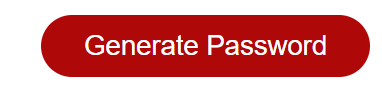
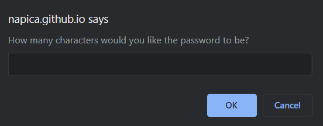
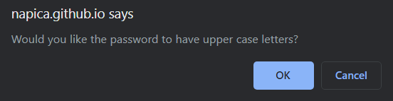
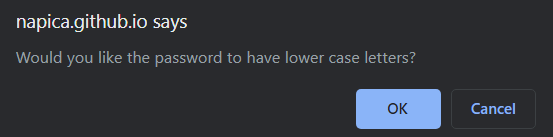
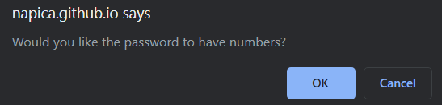
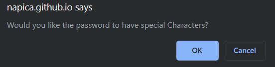
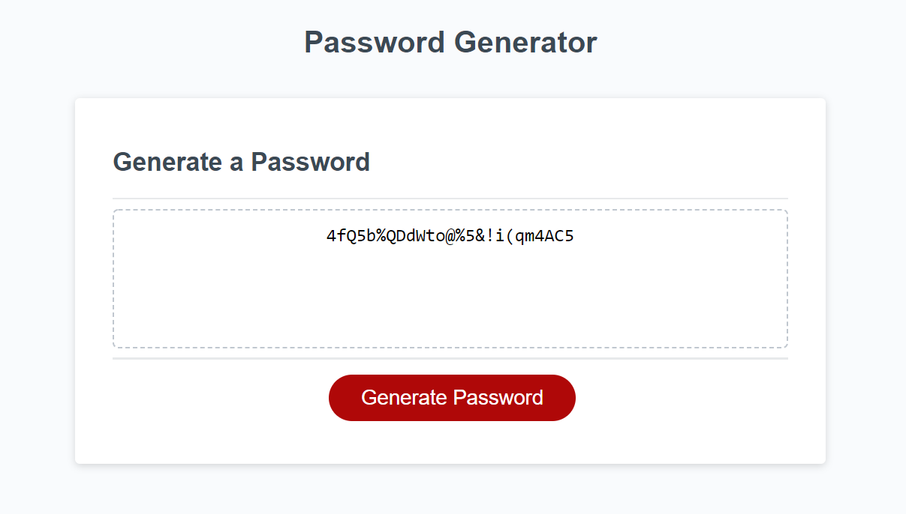

#  G3n-Pass

Each company needs to keep its inforamtion safe and secure.  Even the most secure conscious company still can be vulerable with weakly generated passwords.  Unscrupulous individuals can access a companies network and destroy a company from within.  To help in securing a companies assets, G3n-Pass will ensure, through randomly generated passwords, that password security gets a passing grade. 

## Table of Contents 

*[Purpose](#purpose)
*[Instillation](#instillation)
*[Features](#features)
*[Credits](#credits)

## Purpose 

The purpose of this application is to allow the user to create a randomly generated password that consists of a desired length, upper case letters, lower case letters, numbers and special characters, depending on the user's preference.  

## Instillation 
**To edit/use the application, please follow the steps to pull the repository from GitHub through Git Bash and pull the script into VSCode, provided all three items are already installed on a local network.**

Instillation steps are as follows:
1. Access the repository at [Git Hub] https://github.com/Napica/HW-03-Password-Random-Generator. 
2. Click on the code section (in green) and clone the SSH key.  
3. Once the SSH key is cloned, open the terminal through Git Bash.
4. Find or create the folder the user wants to work in and enter the following commands the the Git terminal:
    1. git clone [copied link]    (*this will allow access the repository to the local computer.*)
    2. git pull (*this will pull all the lines of script from the local repository.*)
    3. code . (*This will extract the code and link the paths to VSCode for review/editing/uploading)

#### [For Direct Access to GitHub provided application site]

Please click on the link below: 
1. https://napica.github.io/HW-03-Password-Random-Generator/

## Features

With G3n-Pass, there are different selections that the user can decide to use to generate a custom, random password.  
#

#
By clicking this button, a user will be prompted with questions to customize their randomly generated password. 
#

#
The user will be able to choose how long they would like their password to be*.

######    *password length must be between 8 - 128 characters only*
#

#
The user will be able to choose from these questions to customize the kind of password they would like to generate. 
#

The result of the randomly generated password can be seen in the example above.  
#

## Credit

I would like to thank the help of my TA's/Tutors/Classmates for the assisstance in making this application possible. 

